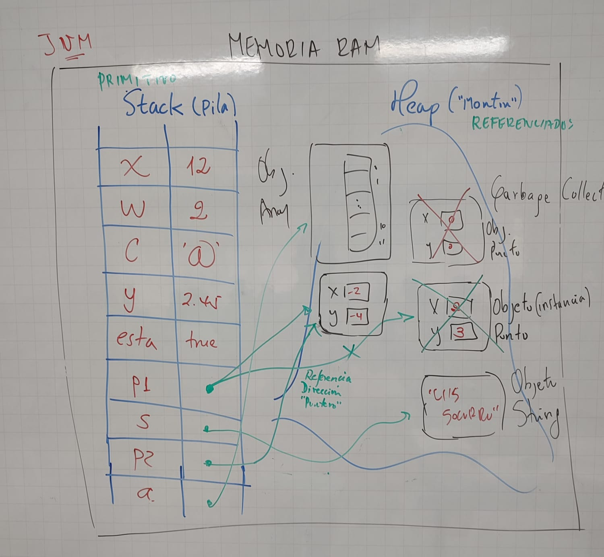

# TIPOS DE DATOS EN JAVA

## JavaVirtualMachine (JVM)

* Realiza una gestión eficiente de la memoria.
* Distribuye la memoria en dos zonas: stack(pila) y heap (monton)

### Stack

* Se almacenan: variables locales, llamadas a metodos (parametros y resutados), variables primitivas, referencias a objetos del heap.
* Memoria estática.

### Heap

* Es gestionado por el garbage collector.
* Espacio de memoria en tiempo de ejecucion donde se registran los objetos.
* Es una memoria dinámica.
* No posee estructura de asignacion de espacios.

## Variable
* Contenedor de memoria donde se almacena informacion.
* En java se declara con un tipo que se conservara durante todo su ciclo de vida en el interior de la aplicacion.
* La variable debe tener un nombre.
* Existen de tipo primitivo y referenciado.

## PRIMITIVOS

* Contenedores de tamaño especifico que almacenan valores y no tienen metodos
* Ejemplos: Boolean, char, byte, shot, long, float, double.

## REFERENCIADOS

* Almacenan  las referencias a los datos.
* Estos datos se escriben en una zona de memoria llamada heap.
* Accesible desde otras instancias de clase 
* Su ciclo de vida termina cunado no se necesita mas.
* Mientras exista al menos una referncia activa en la zona de datos esta se mantendra.
* Tan pronto como no haya mas referencias, la zona se considera no utilizada y se procede a su destruccion por parte del Garbage Collector.
* Un tipo referenciado no puede referenciar nada -> null
* new: intanciacion de una clase. Reserva una direccion de un area de memoria.

### Variable de referencia
* Caracteriza una instancia de clase, es decir la direccion de donde esta el objeto.
* Contiene la direccion de un objeto, cuyo valor por defecto es null.
* Durante una prueba e igualdad entre dos variables, son las direcciones de los objetos lo que se compara y no el contenido de los objetos en si mismos.
* Cuando se una referencia como argumento de un metodo es la direccion del objeto lo que se pasa, y no el objeo en si mismo.
